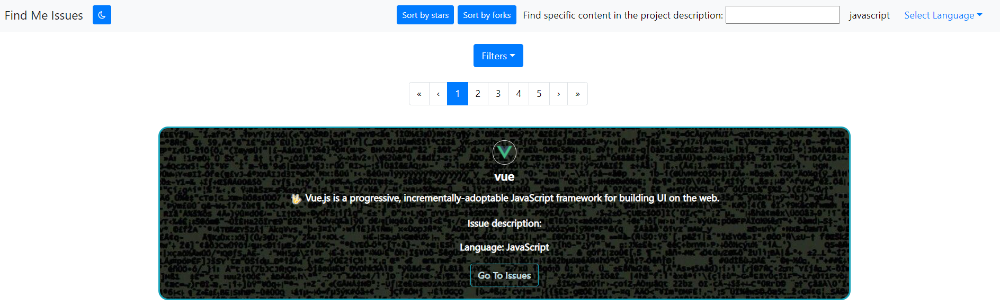

<h1 align="center">Find-Me-Issues</h1>
<p>
  
  <a href="https://github.com/open-devs/fastify-typescript-generator/graphs/commit-activity" target="_blank">
    
  </a>
  <a href="https://github.com/version0chiro/Find-Me-Issues/blob/main/LICENSE" target="_blank">
    
  </a>
</p>  

> A React.js based web-app to find repositories containing 'good first issues' for open source contribution.

## Table of Contents

- [Description](#description)
- [Features](#features)
- [Set Up](#set-up)
- [How to Use](#how-to-use)
- [Contributing](#contributing)
- [License](#license)
- [Acknowledgements](#acknowledgements)

## Description

OpenSource Finder is a user-friendly web application designed to simplify the process of discovering open-source projects suitable for programmers looking to make their first contributions. 
It streamlines the search for beginner-friendly projects across various programming languages, making it easier for developers to kickstart their open-source journey. 
Users can search by the number of starts the repository has, the number of forks, as well as search for keywords to find a project suitable for their interests.

## Inspiration

The most painful thing for programmers who are new to open-source is *finding* beginner friendly projects to contribute.
This issue will be resolved by **Find-Me-Issues**, with a simple and easy to use interface, people will be able to filter the repositories with the type of language they want to work with, number of stars the repository has, number of issues the repository currently has open and much more!

## Features

1) Search Functionality: Quickly find projects based on keywords or project categories.

2) Filter by Programming Language: Easily filter projects by programming language to ensure they are suitable for beginners' skills.

3) Browse Project Details: Access detailed information about each project, including a brief description and recent issues, as well as a link to the project itself.

4) Sorting: Sort by number of stars and number of forks to find the optimal open-source project.

5) Theming: Switch between light and dark themses for a better user experience.




## Usage

### Tech Stack
<p>


</p>

### Set up
```console
$ git clone https://github.com/version0chiro/Find-Me-Issues.git

$ npm i

$ npm run start // this script is for backend

$ npm run build // this script is for frontend

// Access the application in your browser at 'http://localhost:3000'

```

### How to Use

1) Search for Projects: Enter keywords or select programming languages and project categories to search for projects.

2) Filter by Starts and Forks Level: Use the starts filter and the forks filter to narrow down projects that match your experience.

3) Explore Project Details: Read the a brief description about the project and its issues.

4) Get Started: Follow the provided links to the project's repository's issues and start contributing.


## Contributing

Contributions, issues and feature requests are welcome! Guidelines can be found [here](https://github.com/version0chiro/Find-Me-Issues/blob/main/CONTRIBUTING.md).

### Issue Tracking

Find or create new and pertinent issues [here](https://github.com/version0chiro/Find-Me-Issues/issues).

Contributors are encouraged to actively participate in issue tracking by:

- Confirming Issues: If you can reproduce an issue that someone else reported, provide additional details or steps to help diagnose the problem.

- Suggesting Solutions: Offer potential solutions or workarounds for issues you've confirmed or have insight into.

- Prioritizing Issues: Project maintainers often need help in prioritizing and triaging issues. You can help by providing input on the urgency and importance of issues.

- Implementing Fixes: If you have the skills, consider contributing code to fix issues. Please follow the project's contribution guidelines when doing so.

## License

This project is open-source and available under the [MIT License](https://github.com/version0chiro/Find-Me-Issues/blob/main/LICENSE).

## Acknowledgements
<a href="https://github.com/version0chiro/Find-Me-Issues/graphs/contributors">
  
</a>

### Show your support

Give a star if this project helped you!
